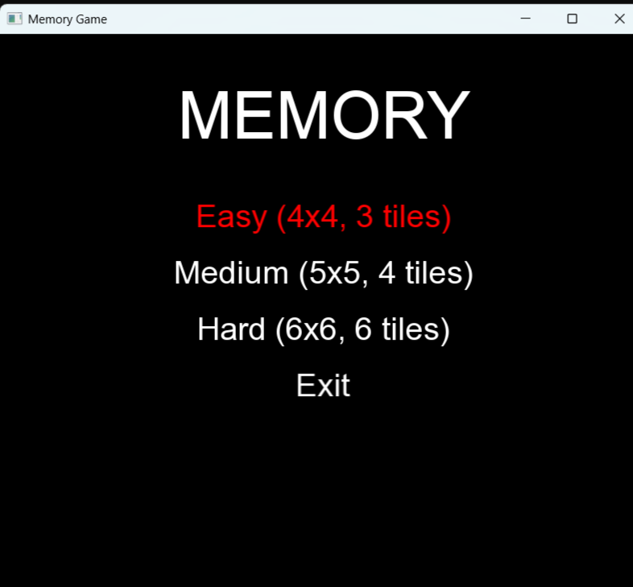
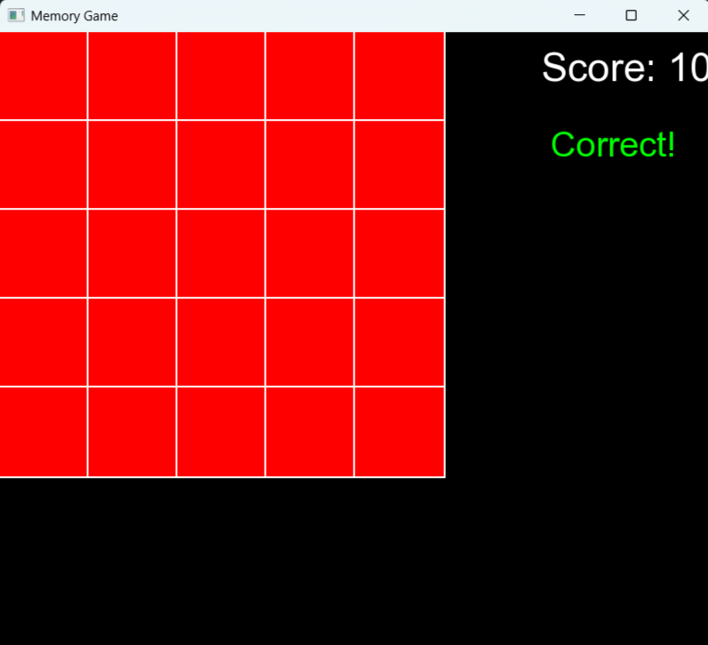
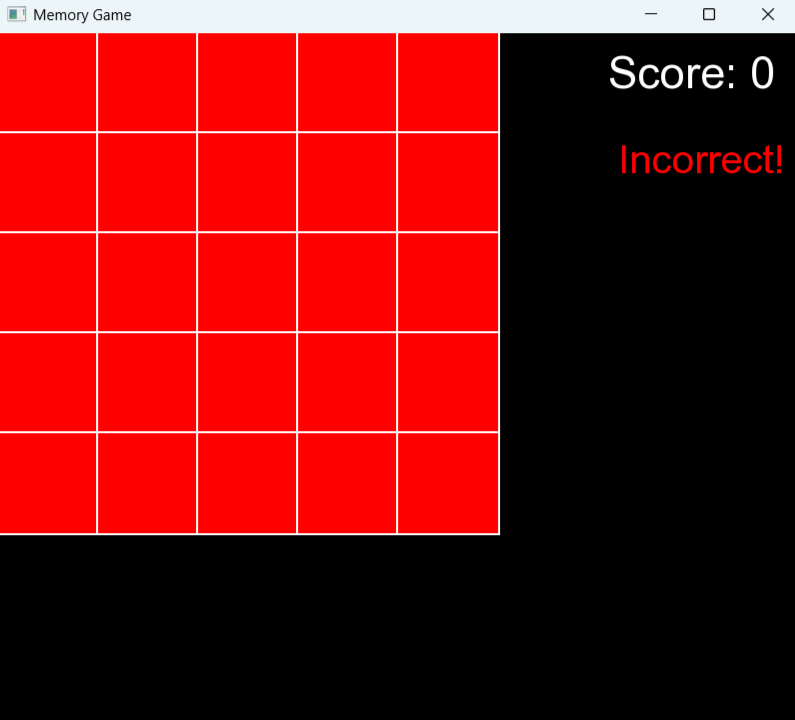

# Memory Game (C++ и SFML)

Игра на запоминание положения активных плиток. Реализована на языке **C++** с использованием библиотеки **SFML** в рамках учебной практики.  
Основная цель — развивать кратковременную зрительную память игрока и навыки программирования графических приложений.

---

## Демо

### Главное меню  


### Игровое поле (Medium)  


### Результат — Correct  


### Результат — Incorrect  


Видео: [Ссылка на YouTube ](https://youtu.be/v0nlV29p1OQ)

---

## Описание проекта

Игроку на короткое время показываются случайно подсвеченные плитки. После этого они скрываются, и нужно выбрать те же плитки по памяти.  
Уровни сложности:
- **Easy**: 4x4 поле, 3 плитки
- **Medium**: 5x5, 4 плитки
- **Hard**: 6x6, 6 плиток

После каждого ответа выводится сообщение (`Correct!` или `Incorrect!`), и счёт обновляется. Escape — выход в меню.

---

## Используемые технологии

- Язык: **C++**
- Графическая библиотека: **SFML 2.5.1**
- Среда: **Visual Studio 2022**
- Система контроля версий: **Git + GitHub**

---

## Особенности и сложности проекта

-  **Полностью ручная реализация GUI** на базе `sf::RectangleShape`, `sf::Text`
- **Тестирование функций** без юнит-тестов — через отладку, визуальный контроль
- Реализована собственная логика `GameBoard`, `Tile`, `Menu` без сторонних фреймворков
- Возврат в меню через ESC и перезапуск раунда — для удобства повторной игры
- Проблема с кодировкой комментариев (Windows-1251 -> UTF-8) успешно решена

---

## Установка и запуск

1. Установите [SFML 2.5.1](https://www.sfml-dev.org/download.php) и подключите к проекту в Visual Studio(как подключить библиотеку можете посмотреть у них на сайте).
2. Склонируйте репозиторий:
   ```bash
   git clone https://github.com/Parmeyyy/Memory_Game.git
